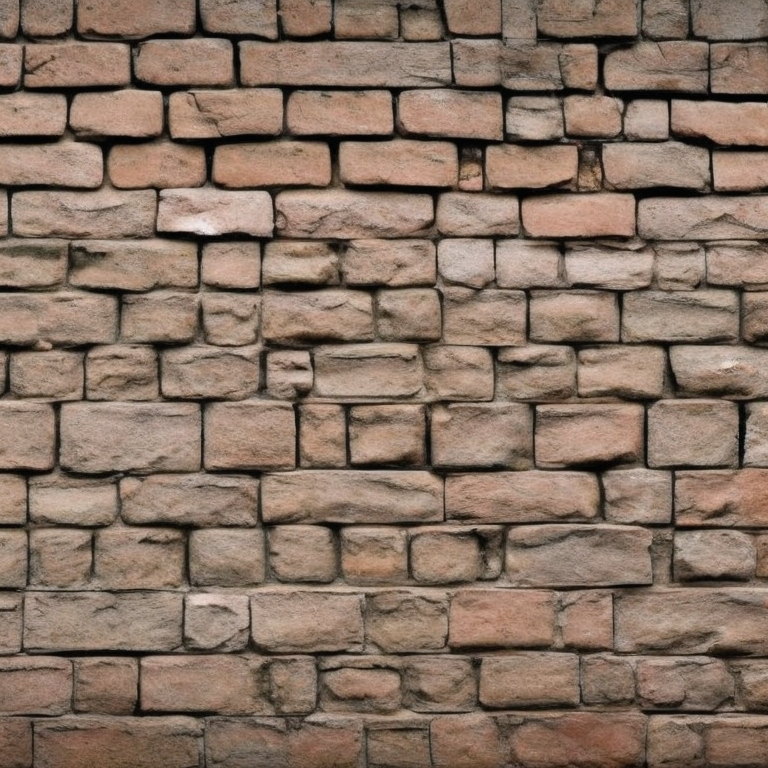
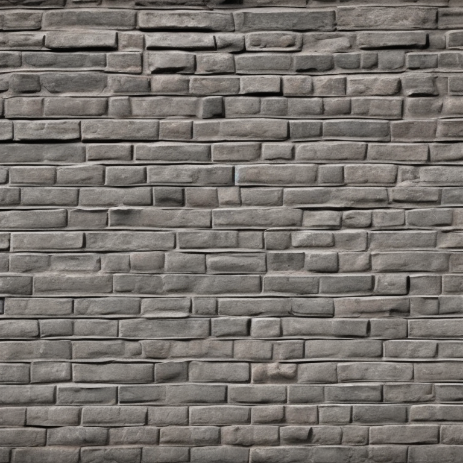
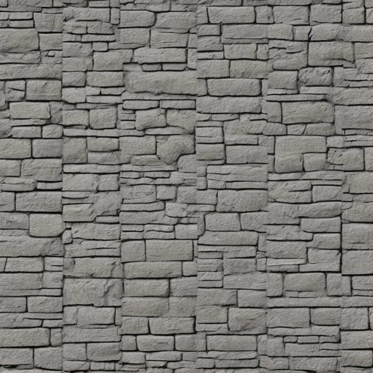
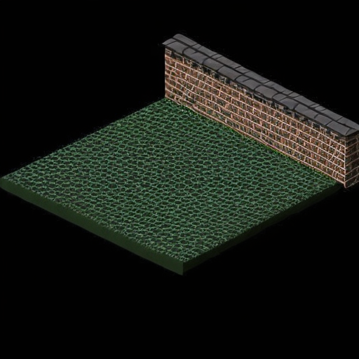
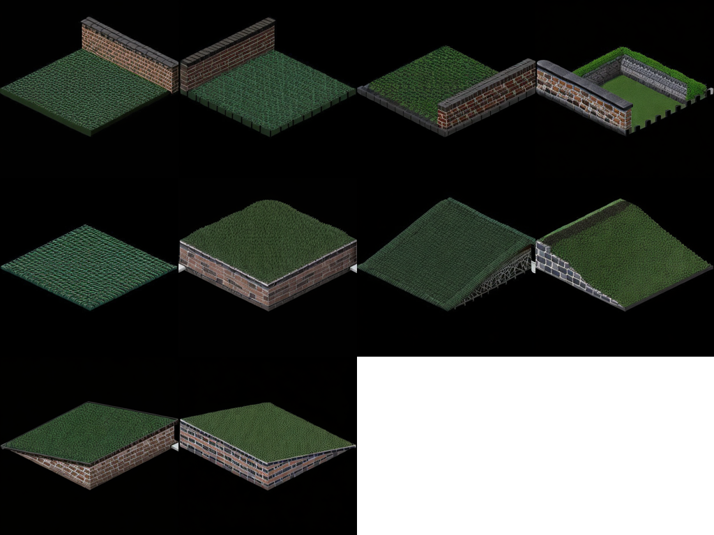

# Charmed
[Charmed](https://charmed.ai) is building AI tools for video game asset creation. You'll find a web version of [this tool](https://dungeon.charmed.ai), plus tools to [generate UV-mapped textures](https://texture.charmed.ai), and [generate quest dialogs](https://quest.charmed.ai).

# Tilemap Generator
The `tilemapgen` tool can be used to generate individual tiles or full tilemaps. The example project uses assets that create isometric view tiles, but the tool should work for other tile geometries with the right geometry inputs.

## Installation

### From pip

First [install pytorch3d](https://github.com/facebookresearch/pytorch3d/blob/main/INSTALL.md), then install the tilemapgen pip.
```bash
pip install tilemapgen
```

Access to the GPU will depend on the environment you are installing into.

### From code
```bash
git clone https://github.com/charmed.ai/tilemapgen
```

Clone this repository.

```bash
cd tilemapgen
conda env create -f environment.yml
```

This package was tested in an anaconda environment built from the included environment.yml file on Ubuntu 22.04.2 LTS with an NVIDIA GeForce RTX 3090 card.

```bash
pip install -e .
```

Install the pip from source


## Usage
`tilemapgen <command> [options]`

By default, outputs will be written to the `projects/example-project` directory but this can be changed by either supplying a `--config_path` with updated configuration, or by using the `--name` and `--parent_path` project arguments.

## swatch
`tilemapgen swatch [-h] [--config_path str] [--name str] [--parent_path Path] [--debug bool] [--prompt str] [--negative_prompt str] [--seed int] [--num_inference_steps int] [--guidance_scale float] [--num_images int]`

The swatch command is used to generate textures that will be used to render a tilemap. Think about this like working with an interior designer to decorate a room. You pick swatches you like to guide the design process.


`tilemapgen swatch --prompt "brick wall" --num_images 3`

Generates 3 swatch images







# render-tile
`tilemapgen render-tile [-h] [--config_path str] [--name str] [--parent_path Path] [--debug bool] [--obj_name str] [--mtl_name str] [--wall_texture_id str] [--floor_texture_id str] [--image_size int] [--camera_dist float] [--elevation_angle float] [--azimuth_angle float]`

The render-tile command is used to render a textured tile geometry using swatches.

`tilemapgen render-tile --wall_texture_id=01290f26-1fb8-463b-a725-cbfeda354d21 --floor_texture_id=a617b331-da86-4fcb-869e-0fdae48ea693`


# generate-tile
`tilemapgen generate-tile [-h] [--config_path str] [--name str] [--parent_path Path] [--debug bool] [--negative_prompt str] [--num_images int] [--seed int] [--num_inference_steps int] [--guidance_scale float] [--rendered_tile_id str] [--prompt str] [--min_strength float] [--max_strength float] [--strength float]`

The generate-tile command uses the StableDiffusion depth2image model to explore variations from a rendered tile.

`tilemapgen generate-tile --rendered_tile_id=b2946e93-7608-49e5-b3be-e469741b25fd`



# tilemap
`tilemapgen [-h] [--config_path str] [--name str] [--parent_path Path] [--debug bool] [--generated_tile_id str] [--width int] [--tile_obj_names List[str]]`

The tilemap command is used to generate a full set of tiles and compile them into a single image for use in a game engine.


`tilemapgen tilemap --generated_tile_id=bff3ad0d-99fb-4883-a663-e905f4eba6a0`


